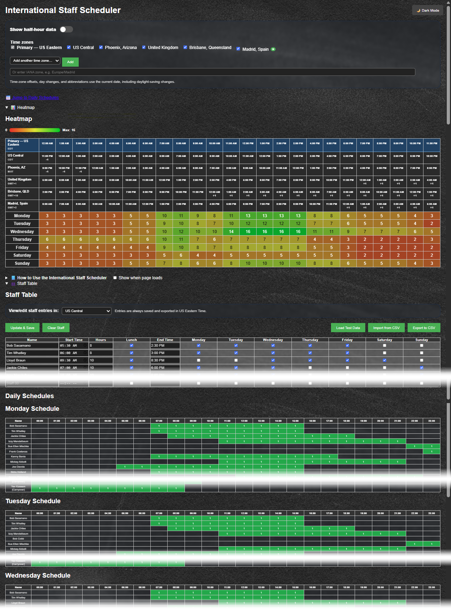

# International Staff Scheduler

International Staff Scheduler is a browser-based scheduling and coverage tool for teams working across multiple regions. It provides staff entry, automatic shift calculations, a weekly coverage heatmap, daily schedule views, time-zone conversion, CSV import and export, local browser storage, and light or dark display modes.



## Features

### Staff scheduling

- Enter up to 30 staff members.
- Record each employee's name, start time, scheduled hours, lunch selection, and working days.
- Calculate end times automatically.
- Support shifts that cross midnight.
- View schedules in hourly or half-hour intervals.

### International time-zone display

The heatmap uses US Eastern Time as the primary reference row. Optional time-zone rows appear directly beneath it so equivalent times remain aligned with the same coverage column.

Included zones:

- US Eastern: `America/New_York`
- US Central: `America/Chicago`
- Phoenix, Arizona: `America/Phoenix`
- United Kingdom: `Europe/London`
- Brisbane, Queensland: `Australia/Brisbane`

Additional zones can be added from the supplied list, including Madrid, Paris, Berlin, India, Singapore, Tokyo, and Auckland. A custom browser-supported IANA time-zone name can also be entered, such as `Europe/Madrid`.

Time-zone abbreviations and offsets are calculated using the current date, so daylight-saving changes are handled automatically where applicable.

### Day-change indicators

A small marker appears beneath a converted heatmap time when the local calendar day differs from the primary Eastern day:

- `+1` means the next calendar day.
- `-1` means the previous calendar day.
- No marker is displayed when the time remains on the same calendar day.

### Staff-entry viewing zone

The staff table can be viewed and edited in any available time zone. When the selected viewing zone crosses midnight, the displayed weekday and time are converted together.

US Eastern Time remains the canonical storage format. Schedule data is always saved and exported in Eastern Time regardless of the zone used while viewing or editing.

### Dynamic coverage heatmap

The heatmap color scale adjusts to the current schedule:

- Zero coverage is red.
- The highest staffing count currently displayed is green.
- Intermediate values transition through orange and yellow.
- The legend reports the current maximum.

### Additional capabilities

- Weekly heatmap and daily schedule tables
- CSV import and export
- Automatic browser-based saving with `localStorage`
- Optional sample data
- Clear schedule control
- Persistent light and dark mode preference
- Persistent time-zone display preferences

## Getting Started

No installation or web server is required.

1. Extract the project files to a folder.
2. Open `index.html` in a modern browser.
3. Enter staff information or import an existing CSV file.
4. Select the desired staff-entry viewing time zone.
5. Select the optional heatmap time zones to display.
6. Choose hourly or half-hour coverage.
7. Select **Update & Save** to refresh the heatmap and daily schedules.

## Staff-Entry Time-Zone Workflow

A manager in another region can work in local time without changing the stored schedule standard.

Example:

1. Select Brisbane as the staff-entry viewing zone.
2. Enter or revise the employee's local Brisbane time and working day.
3. Select **Update & Save**.
4. Switch the viewing zone back to US Eastern.
5. The corresponding Eastern time and weekday will be displayed.
6. Exported CSV data will use the Eastern values.

## CSV Format

CSV files use the following columns:

```csv
Name,Start Time,Hours,Lunch,End Time,Monday,Tuesday,Wednesday,Thursday,Friday,Saturday,Sunday
Jane Doe,06:00,8,No,14:00,Yes,Yes,No,No,Yes,No,No
```

Field guidance:

- `Start Time` and `End Time` use 24-hour `HH:mm` format.
- `Hours` is the number of scheduled work hours.
- `Lunch` uses `Yes` or `No`.
- Weekday fields use `Yes` or `No`.
- Imported and exported times are interpreted as US Eastern Time.

## Data Storage

The scheduler supports shared-file storage with an automatic browser-cache fallback.

- On startup, the application attempts to load `staff-data.json` from the same directory as `index.html`.
- When a schedule is saved, the application first updates the local browser cache and then attempts to write the shared file using an HTTP `PUT` request.
- If the shared directory is unavailable, missing, or read-only, the schedule remains safely stored in the current browser using `localStorage`.
- The storage status shown above the staff table indicates whether the shared file or local browser cache is active.
- The Load Shared File and Save Shared File buttons allow users to retry either operation manually.

A normal static web server often permits reading files but does not permit writing them. Shared saving requires a server or storage service configured to accept `PUT` requests to `staff-data.json`. Opening `index.html` directly with a `file://` address normally uses the local browser cache because browsers do not allow a web page to rewrite neighboring files automatically.

Use CSV export as an additional portable backup before clearing browser data or moving to another device.

## Project Files

- `index.html` contains the application structure.
- `styles.css` contains layout, heatmap, time-zone, and theme styling.
- `script.js` contains the active scheduling, conversion, heatmap, shared-storage fallback, and CSV logic.
- `staff-data.json` is the optional shared schedule file located beside `index.html`.
- `LightBackground.png` and `DarkBackground.png` provide the visual backgrounds.
- `preview.png` is the project preview image.
- `LICENSE` contains the project license.

The application currently loads `script.js`. The other JavaScript files in the project folder are retained copies and are not loaded by `index.html`.

## Browser Compatibility

Use a current version of Chrome, Edge, Firefox, or Safari. Custom time zones depend on the browser's support for the requested IANA time-zone identifier.

## License

See the `LICENSE` file included with the project.

## Staff table display options

- The Schedule storage panel starts collapsed when the page loads. Expand it to load from or save to the shared JSON file.
- The Staff table rows control provides two views:
  - Show all entries displays all 30 available staff rows.
  - Hide empty entries displays only rows containing schedule information.
- Hiding empty entries does not delete data or reduce the number of available rows. The selected view is saved in the browser.
